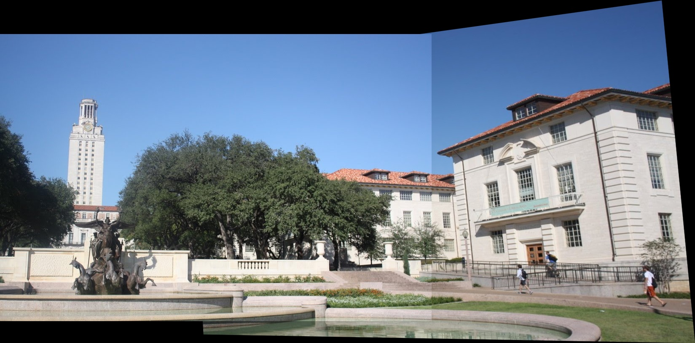
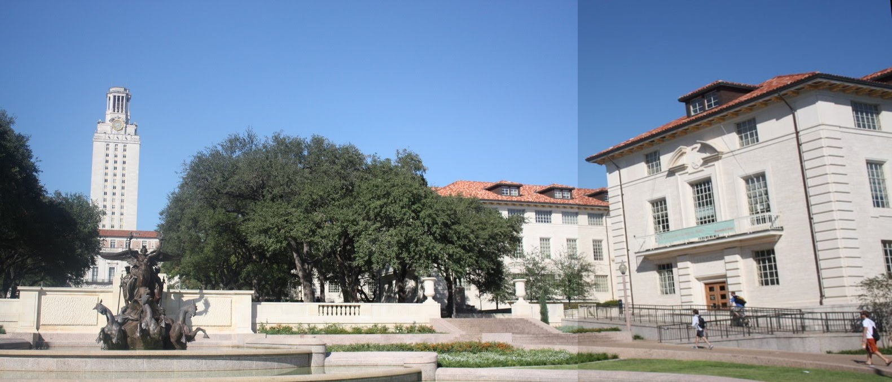

# SIFT Image Stitching
This project implements image stitching and panorama creation using the Scale-Invariant Feature Transform (SIFT) algorithm. It combines two images into a single seamless panorama using Python.

## Installation
Required: Python 3.x, OpenCV, NumPy
```bash
pip3 install opencv-python numpy
```

## Usage
```python
import cv2
from utils.combine import stitch_image 
from utils.panorama import make_panorama

image_pair_list = [
    ['./images/original/pairs_01_01.jpg', './images/original/pairs_01_02.jpg'],
    ['./images/original/pairs_02_01.png', './images/original/pairs_02_02.png'],
    ['./images/original/pairs_03_01.jpg', './images/original/pairs_03_02.jpg'],
    ['./images/original/pairs_04_01.jpg', './images/original/pairs_04_02.jpg'],
]

idx = 0
for image_pair in image_pair_list:
    idx += 1
    img1_path = image_pair[0]
    img2_path = image_pair[1]

    stitch_image_result = stitch_image(img1_path, img2_path)
    stich_image_name = "./images/combined/pairs_{}.jpg".format(idx)

    cv2.imwrite(stich_image_name, stitch_image_result)
    print("Created stich image:" + stich_image_name)

    panorama_image_result = make_panorama(stitch_image_result)
    panorama_image_name = "./images/panorama/pairs_{}.jpg".format(idx)
    
    cv2.imwrite(panorama_image_name, panorama_image_result)
    print("Created panorama image:" + panorama_image_name)
```

## Example
Example of image striching combining two images and creating a panorama.

### Original Image
| Image 1                            | Image 2                            |
| ----------------------------------- | ----------------------------------- |
|  |  |

### Combined Image


### Panorama Image


## License
BSD-3-Clause License. See [LICENSE](./LICENSE).

## Acknowledgments
References: D. G. Lowe, "Object recognition from local scale-invariant features," Proceedings of the Seventh IEEE International Conference on Computer Vision, Kerkyra, Greece, 1999, pp. 1150-1157 vol.2, doi: 10.1109/ICCV.1999.790410.
